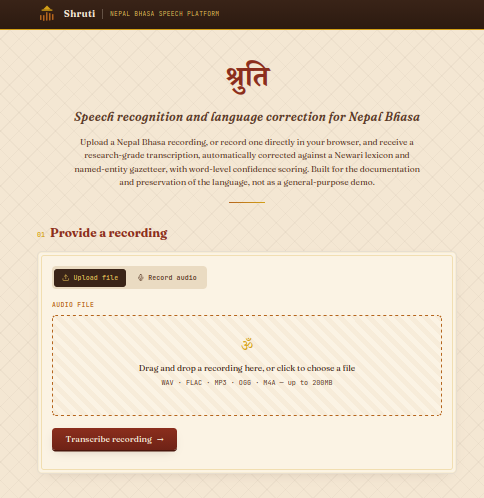
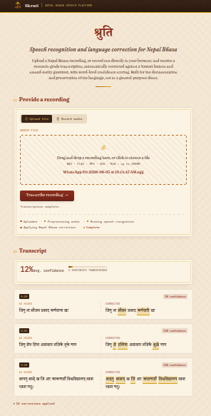

<div align="left">

# Shruti

### Nepal Bhasa Speech Recognition Platform

A local speech-to-text and autocorrection pipeline for Nepal Bhasa (Newari), combining a NeMo-based ASR model with a SymSpell-driven noisy-channel correction engine.

[](https://www.python.org/)
[](https://flask.palletsprojects.com/)
[](https://github.com/NVIDIA/NeMo)
[](#license)

[Getting Started](#getting-started) ·
[Architecture](#system-architecture) ·
[Components](#components) ·
[Screenshots](#screenshots) ·
[References](#references)

</div>

---

## Table of Contents

- [Getting Started](#getting-started)
- [System Architecture](#system-architecture)
- [Components](#components)
  - [Correction Engine](#correction-engine)
  - [Audio Processing](#audio-processing)
  - [Web Interface](#web-interface)
- [Artifacts](#artifacts)
- [Project Structure](#project-structure)
- [Screenshots](#screenshots)
- [Dependencies](#dependencies)
- [References](#references)
- [License](#license)

---

## Getting Started

> **New to this repo?** Just copy the command in "One-time setup" below into your terminal. It handles everything — cloning, environment, dependencies, and launching the app.

### One-time setup

Run this once on a new machine. It clones the repo, enters the app directory, and runs `start.sh`, which creates the virtual environment, installs dependencies, and launches the app in your browser.

```bash
git clone -b deploy https://github.com/PrageshShrestha/newari_translation.git && cd newari_translation/newari_asr_app && chmod +x start.sh && ./start.sh
```

If you are not familiar with the terminal: paste the entire line above into your terminal window and press Enter. It will take a few minutes the first time while it downloads dependencies. Once it finishes, your browser will open automatically at `http://127.0.0.1:5000`.

### Every time after that

You do not need to repeat the setup. From inside the `newari_asr_app` folder, just run:

```bash
./start.sh
```

`start.sh` detects the existing `newari_asr_env` virtual environment and skips reinstalling dependencies unless you explicitly ask it to.

---

## System Architecture

```
Audio Input (Upload/Mic)
        │
        ▼
Preprocessing (resample to 16kHz mono)
        │
        ▼
Voice Activity Detection (segment speech)
        │
        ▼
ASR Model (NeMo Conformer)
        │
        ▼
Correction Engine (SymSpell + language model)
        │
        ▼
Web UI (Flask) — raw output + corrected output
```

---

## Components

### Correction Engine

`correction_engine.py` implements a noisy-channel spelling correction pipeline on top of a vocabulary and bigram language model built from artifact files.

```python
from correction_engine import CorrectionEngine

engine = CorrectionEngine(artifacts_dir="artifacts")

# Optionally include a confusion-pair CSV from an evaluation run
engine = CorrectionEngine(
    artifacts_dir="artifacts",
    confusion_csv="word_substitution_pairs.csv"
)

corrected_text, changes = engine.correct_text("misrecognized text")
```

Pipeline stages, as documented in the original project notes:

1. **Vocabulary check** — words already present in the training vocabulary are left unchanged, to avoid over-correcting valid output.
2. **SymSpell lookup** — unknown words are matched against a delete-variant index (max edit distance = 2).
3. **Weighted edit distance** — candidate scoring uses phonetically-aware substitution costs between confusable characters.
4. **Language model scoring** — candidates are ranked with unigram/bigram probabilities from the training corpus, combined with edit cost via a weighting parameter (`LAMBDA`).
5. **Confusion-based correction (optional)** — if `word_substitution_pairs.csv` is supplied, observed ASR substitution patterns are applied as a second pass.

### Audio Processing

Handled in `run_browser.py`:

- Input audio is resampled to 16kHz mono before being passed to the ASR model.
- Multi-channel audio is downmixed to mono.
- Long recordings are segmented using voice activity detection before transcription.

### Web Interface

`run_browser.py` runs a Flask application that serves a single-page interface for:

- Drag-and-drop audio upload
- Triggering transcription and correction
- Displaying raw ASR output alongside corrected text
- Listing the corrections that were applied

---

## Artifacts

The correction engine expects these files inside `artifacts/`:

| File | Purpose |
|---|---|
| `dictionary.bin` | Word list with unigram log-probabilities |
| `bigrams.bin` | Word-pair frequency counts |

Optional files at the project root:

| File | Purpose |
|---|---|
| `gazetteer_everestner.txt` | Proper-noun list for named-entity aware correction |
| `word_substitution_pairs.csv` | Observed ASR confusion pairs, used for second-pass correction |

---

## Project Structure

```
newari_asr_app/
├── start.sh                    # One-command setup + launch
├── setup.sh                    # Standalone environment setup
├── run_browser.py              # Flask web application
├── correction_engine.py        # Correction engine (usable standalone)
├── requirements.txt
├── artifacts/
│   ├── dictionary.bin
│   ├── bigrams.bin
│   └── word_substitution_pairs.csv
├── gazetteer_everestner.txt
├── word_substitution_pairs.csv
├── uploads/                     # Temporary audio storage
└── README.md
```

---

## Screenshots

<div align="center">

**Main Interface**



**Transcription Results**



</div>

---

## Dependencies

Confirmed from `run_browser.py` and `correction_engine.py`:

- **Flask** — web server
- **NeMo Toolkit** — ASR model loading and inference
- **PyTorch** — deep learning backend for the ASR model
- **SoundFile** — audio I/O
- **SciPy** — audio resampling
- **SymSpellPy** — delete-variant edit-distance lookup
- **OmegaConf** — NeMo model configuration

System dependency:

- **FFmpeg** — required for decoding browser microphone recordings (webm/Opus). Uploaded WAV/FLAC files work without it.

---

## References

- **NVIDIA NeMo** — toolkit used for the ASR model. https://github.com/NVIDIA/NeMo
- **SymSpell** — delete-based spelling correction algorithm underlying the correction engine's candidate lookup. https://github.com/wolfgarbe/SymSpell
- **Flask** — web framework serving the application. https://flask.palletsprojects.com/
- **PyTorch** — deep learning framework used by NeMo. https://pytorch.org/
- **SoundFile** — audio file I/O library. https://github.com/bastibe/python-soundfile
- **SciPy** — used for audio resampling. https://scipy.org/

If a voice activity detection model, a specific ASR checkpoint, or additional corpora are used in your deployment, add them here with their source links once confirmed — avoid listing anything not directly verifiable from the code.

---

## License

Add your chosen license here (for example, MIT, Apache 2.0). Third-party components above are subject to their own respective licenses — check each project's repository before redistribution.

---

<div align="center">

Built for Nepal Bhasa language documentation and preservation.

</div>
